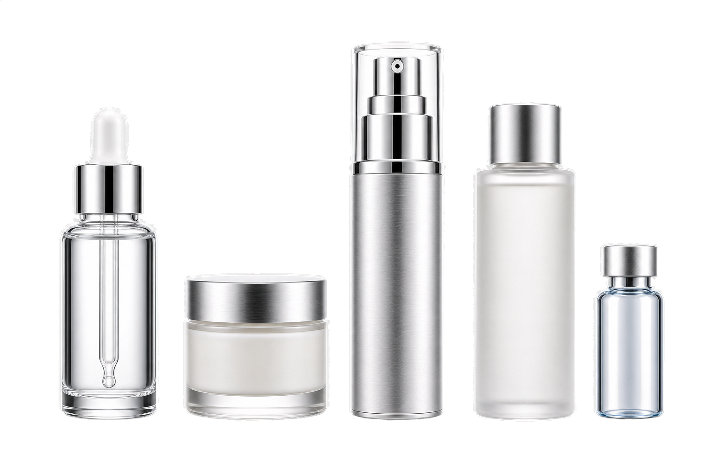
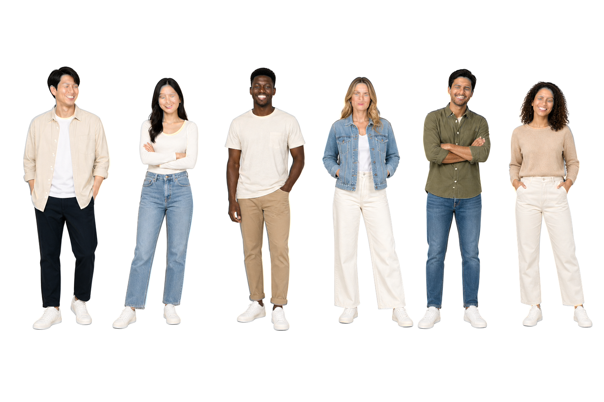
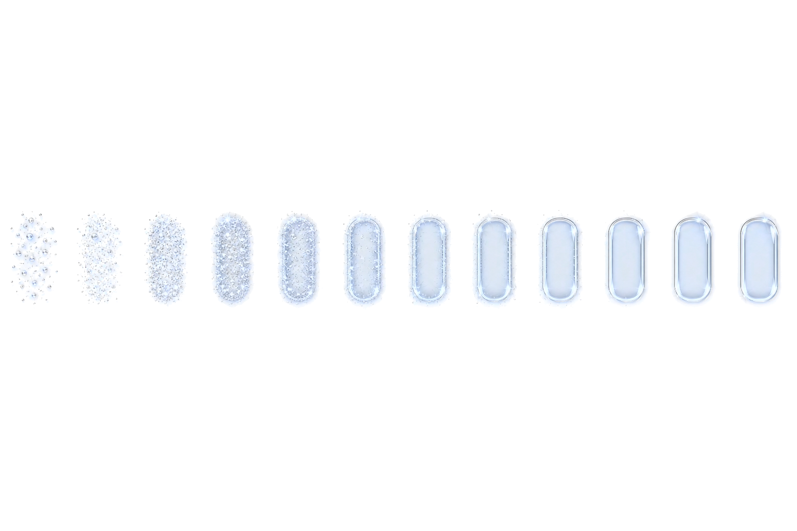

# Alphakit

Codex skill for generating, exporting, extracting, and verifying standard or transparent image assets.

Alphakit is built for practical asset work: Codex image generation, PNG/JPEG/WebP conversion, alpha-channel verification, and black/white extraction.

It supports:

- standard image generation/export to PNG, JPEG, or WebP
- Codex image generation as the source-image generator for prompt-to-image work
- verifying whether a PNG/WebP has a real alpha channel
- extracting alpha from aligned black/white pairs, with a controlled green third-background candidate
- strict and opt-in `soft-photoreal` quality profiles for hair, shadows, glass, smoke, and other soft alpha edges
- self-tests that verify black/white extraction and reject misaligned pairs

## Install

Clone Alphakit directly into your Codex skills directory:

```bash
mkdir -p ~/.codex/skills
git clone git@github.com:vidhatanand/alphakit.git ~/.codex/skills/alphakit
```

Restart Codex after installing so the skill is discovered.

To update an existing Alphakit install:

```bash
cd ~/.codex/skills/alphakit
git pull
```

If you previously installed an older copy, install a fresh Alphakit checkout in `~/.codex/skills/alphakit` and remove the older folder only after the new skill is discovered.

Restart Codex after updating.

## Use

Invoke it by name:

```text
Use $alphakit to create a true transparent PNG from this image prompt.
```

For a standard image:

```text
Use $alphakit to generate this prompt as a JPEG.
```

For an existing image:

```text
Use $alphakit to remove the background from this image and verify the PNG has real transparency.
```

If you do not specify `PNG`, `JPEG`, or `WebP`, Alphakit defaults to a true transparent PNG. If you explicitly ask for a standard or opaque image without naming a format, it exports an opaque PNG.

For prompt-to-image requests, Alphakit uses Codex image generation first, then creates an aligned black/white pair and applies `scripts/alpha_from_black_white.py` for transparency extraction, export, and alpha verification. Generated source files and processed outputs should be kept separate so the workflow is auditable.

## Demo Assets

Committed demo assets must use the black/white pair workflow:

1. Generate the black-background source with Codex image generation.
2. Read the black image's actual pixel dimensions.
3. Generate the white image with the black image as reference input, requesting the actual black-image size and changing only the background to white.
4. Run `scripts/add_demo_pair.py`.
5. If black/white fails because `negative_diff_ratio` exceeds threshold, generate a green-background third image from the black image reference and rerun `scripts/add_demo_pair.py --green`.
6. Verify the PNG/WebP with `scripts/verify_alpha.py`.
7. For `--quality-profile soft-photoreal`, inspect the staged output and rerun with `--visual-qa-pass` only if you accept the visible edge/noise tradeoff.

Do not commit procedural demos, chroma-key demos, or single-background-removal demos.

Accepted demos:

| Demo | PNG | WebP | Profile | Selected Candidate | Report |
| --- | --- | --- | --- | --- | --- |
| Photorealistic product cutouts |  | [WebP](examples/transparent/photorealistic-product-cutouts.webp) | `strict` | `black-green` | [report](examples/reports/photorealistic-product-cutouts.json) |
| Photorealistic human/model cutouts |  | [WebP](examples/transparent/photorealistic-human-model-cutouts.webp) | `soft-photoreal` + user visual QA | `black-white` | [report](examples/reports/photorealistic-human-model-cutouts.json) |
| Hair alpha stress test |  | [WebP](examples/transparent/hair-alpha-stress-test.webp) | `soft-photoreal` + user visual QA | `black-green` | [report](examples/reports/hair-alpha-stress-test.json) |
| Web animation sprite strip |  | [WebP](examples/transparent/web-animation-sprite-strip.webp) | `soft-photoreal` + user visual QA | `black-white` | [report](examples/reports/web-animation-sprite-strip.json) |

Generate demo candidates:

```bash
Use Codex imagegen to create the black image, then use Codex imagegen again with the black image as reference input to create the white image at the black file's actual size.
```

After each pair is generated, validate and copy it with:

```bash
python3 scripts/add_demo_pair.py \
  --demo-id photorealistic-product-cutouts \
  --black /path/to/demo-black.png \
  --white /path/to/demo-white.png \
  --force
```

Green fallback, only after the black/white report shows `negative_diff_ratio` above threshold:

```bash
python3 scripts/add_demo_pair.py \
  --demo-id photorealistic-product-cutouts \
  --black /path/to/demo-black.png \
  --white /path/to/demo-white.png \
  --green /path/to/demo-green.png \
  --force
```

For hair, shadows, glass, smoke, or photoreal soft edges, use the relaxed profile only when you accept possible artifacts:

```bash
python3 scripts/add_demo_pair.py \
  --demo-id hair-alpha-stress-test \
  --black /path/to/demo-black.png \
  --white /path/to/demo-white.png \
  --green /path/to/demo-green.png \
  --quality-profile soft-photoreal \
  --force
```

That command stages a PNG/WebP and stops with `requires-visual-qa`. After inspecting the staged output, copy it into `examples/` only with:

```bash
python3 scripts/add_demo_pair.py \
  --demo-id hair-alpha-stress-test \
  --black /path/to/demo-black.png \
  --white /path/to/demo-white.png \
  --green /path/to/demo-green.png \
  --quality-profile soft-photoreal \
  --visual-qa-pass \
  --visual-qa-note "Accepted after visual QA." \
  --force
```

The validator copies only passing demos into `examples/pairs/`, `examples/transparent/`, and `examples/reports/`. It does not require `OPENAI_API_KEY`. If Codex imagegen is not installed or not available in the current Codex session, stop and warn instead of using API-backed generation.

## Advanced Prompt Recipes, Not Demo Assets

Use these prompts with Alphakit when you want production-grade transparent assets. The demo manifest in `examples/demo_prompts.json` mirrors these categories for the strict black/white pair generation workflow.

### Photorealistic Product Cutout Set

```text
Use $alphakit to generate a transparent PNG and lossless WebP product cutout set: five premium skincare bottles arranged as separate isolated objects, photorealistic studio lighting, clear glass and brushed aluminum materials, visible liquid refraction, subtle contact shadows that remain part of the alpha subject, no floor, no backdrop, no checkerboard, no text, no watermark. Output at 2048x2048 with clean semi-transparent edge pixels suitable for ecommerce hover animations.
```

### Photorealistic Human Cutout Set

```text
Use $alphakit to generate a transparent PNG and lossless WebP human cutout set: six generic adult people, full-body, diverse outfits and poses, photorealistic studio lighting, realistic hair edges and fabric detail, each person isolated with clear spacing, no celebrities, no logos, no text, no floor, no backdrop, no checkerboard. Output at 3072x2048 with true alpha, preserve natural semi-transparent hair pixels, and verify transparency.
```

### Fashion Model Catalog Cutouts

```text
Use $alphakit to generate transparent PNG and lossless WebP fashion model cutouts: four generic adult models wearing unbranded streetwear, ecommerce catalog style, front three-quarter poses, realistic skin texture, fabric folds, shoes fully visible, soft contact shadows included only under each subject, no background, no studio wall, no text, no watermark. Export clean alpha for web product cards and verify PNG/WebP transparency.
```

### Photorealistic Hair Alpha Stress Test

```text
Use $alphakit to generate a transparent PNG portrait cutout of a generic adult model with detailed curly hair, photorealistic lighting, shoulders-up composition, clean alpha around individual hair strands, no background color, no halo, no checkerboard, no text. If native alpha fails, use an aligned black/white pair extraction and report edge quality before exporting WebP.
```

### Web Animation Sprite Strip

```text
Use $alphakit to generate a transparent PNG sprite strip for a website hero animation: 12 horizontal frames, each frame 256x256, a premium glassmorphism CTA badge assembling from soft particles into a sharp button, consistent center alignment, frame-to-frame motion continuity, transparent background, no page mockup, no text, no checkerboard. Also export a lossless WebP with alpha and verify transparency.
```

### Game Asset Pack

```text
Use $alphakit to generate a transparent PNG game asset sheet: 8x8 grid, 128px cells, top-down fantasy RPG items including potions, coins, keys, gems, crates, scrolls, hearts, and spell projectiles, consistent camera angle, readable silhouettes, no background, no shadows outside each cell, no text. Export PNG plus lossless WebP and verify alpha.
```

### Game Avatar Sprite Sheet

```text
Use $alphakit to generate a transparent PNG game avatar sprite sheet: one original non-celebrity character, 8 columns x 6 rows, 128px cells, idle, walk, run, jump, attack, and hurt animations, consistent proportions and outfit across all frames, pixel-perfect transparent background, no cell borders, no text, no shadows clipped at frame edges. Export PNG plus lossless WebP and verify every frame has alpha.
```

### Dialogue Avatar Portrait Pack

```text
Use $alphakit to generate a transparent PNG dialogue avatar pack: 12 original game character bust portraits, consistent art direction, varied expressions, clean silhouettes, readable at 256px, no copyrighted characters, no background, no text, no UI frame. Export as one sprite sheet plus individual transparent PNG crops, then verify alpha for every output.
```

### Game VFX Frames

```text
Use $alphakit to generate a transparent PNG VFX sprite sheet: 16 frames in a single row, a fire-to-magic impact burst expanding then fading, consistent origin point, no camera movement, bright core, smoke wisps with semi-transparent alpha, no black background, no checkerboard. Verify the PNG/WebP alpha and reject the result if any frame is opaque.
```

When adding demos, include the black image, white image, final transparent PNG/WebP, prompt manifest, and extraction report.

## Export Standard Images

```bash
python3 scripts/export_image.py \
  --input generated.png \
  --format jpeg \
  --out final.jpg \
  --background "#ffffff"
```

Use `--format webp --quality 90` for standard WebP output, or `--preserve-alpha --lossless` when WebP transparency is required.

## Verify Transparency

```bash
python3 scripts/verify_alpha.py output.png
```

If your system Python does not have Pillow installed, use the bundled Codex runtime:

```bash
/Users/vid/.cache/codex-runtimes/codex-primary-runtime/dependencies/python/bin/python3 \
  scripts/verify_alpha.py output.png
```

## Best Extraction Method

The most reliable extraction method is an aligned black/white pair:

```bash
python3 scripts/alpha_from_black_white.py \
  --black subject-on-black.png \
  --white subject-on-white.png \
  --out subject-transparent.png
```

This only works when both source images have identical subject placement and foreground pixels. Two independent AI generations usually do not align and should be treated as unsafe unless artifacts are acceptable.

## Test

```bash
/Users/vid/.cache/codex-runtimes/codex-primary-runtime/dependencies/python/bin/python3 \
  scripts/self_test.py
```

Expected result includes:

- aligned black/white alpha extraction with very low error
- misaligned black/white pair rejected
- strict rejection plus `soft-photoreal` acceptance for a synthetic negative-diff case
- relaxed demo import blocked until `--visual-qa-pass`
- PNG and WebP alpha verification passing
- standard JPEG and WebP export passing
- demo pair generator dry-run passing
