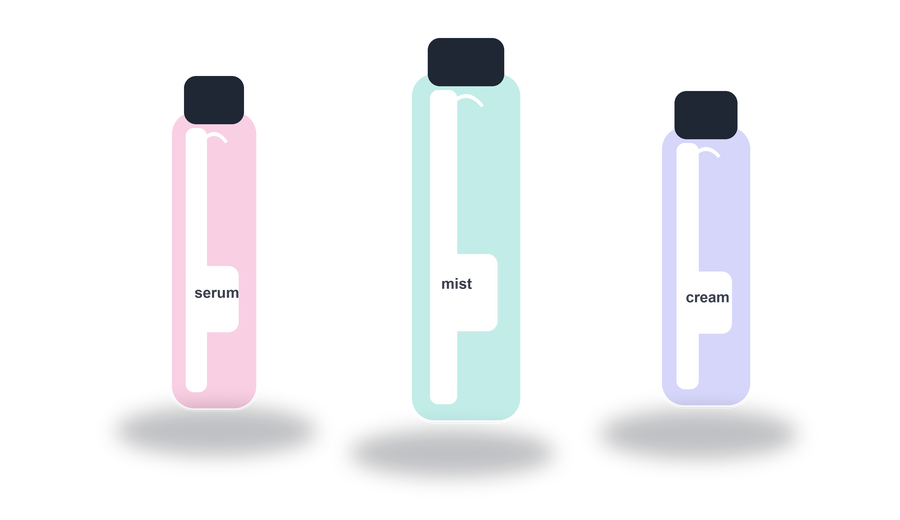
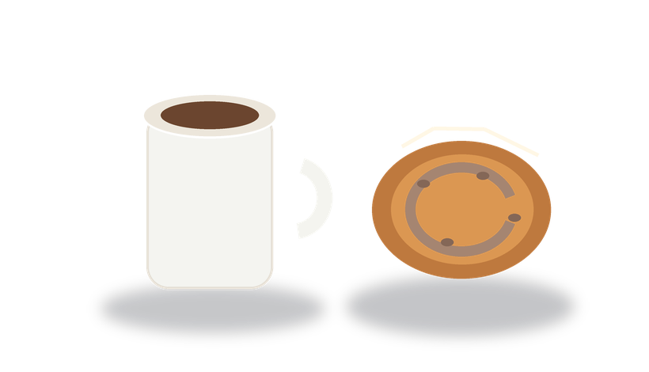

# Alphakit

Codex skill for generating, exporting, extracting, and verifying standard or transparent image assets.

Alphakit is built for practical asset work: prompt-to-image output, PNG/JPEG/WebP conversion, alpha-channel verification, black/white extraction, and background removal checks.

It supports:

- standard image generation/export to PNG, JPEG, or WebP
- verifying whether a PNG/WebP has a real alpha channel
- extracting alpha from aligned black-background and white-background image pairs
- approximate single-solid-background removal
- reproducible transparent example assets with prompts
- synthetic self-tests that compare method quality and reject misaligned pairs

## Install

Clone Alphakit directly into your Codex skills directory:

```bash
mkdir -p ~/.codex/skills
git clone git@github.com:vidhatanand/alphakit.git ~/.codex/skills/alphakit
```

Restart Codex after installing so the skill is discovered.

To update an existing Alphakit install:

```bash
cd ~/.codex/skills/alphakit
git pull
```

If you previously installed an older copy, install a fresh Alphakit checkout in `~/.codex/skills/alphakit` and remove the older folder only after the new skill is discovered.

Restart Codex after updating.

## Use

Invoke it by name:

```text
Use $alphakit to create a true transparent PNG from this image prompt.
```

For a standard image:

```text
Use $alphakit to generate this prompt as a JPEG.
```

For an existing image:

```text
Use $alphakit to remove the background from this image and verify the PNG has real transparency.
```

If you do not specify `PNG`, `JPEG`, or `WebP`, Alphakit instructs Codex to ask for the needed output format before generating or exporting.

## Examples

The `examples/transparent/` folder contains verified transparent PNG assets and lossless WebP exports. Each example includes the source prompt in `examples/prompts.json`.

| Asset | Type | Prompt |
| --- | --- | --- |
|  | Icon sprite sheet | `A compact transparent PNG sprite sheet with four polished app icons: sparkle, shield, lightning bolt, and cursor pointer, crisp vector-like edges, no background.` |
|  | Web page design element | `A transparent PNG website navigation component with frosted glass pill, subtle border, tab indicators, and no page background.` |
|  | Badge / sticker | `A transparent PNG launch badge for a modern AI tool, layered sticker shape, subtle shadow, clean edges, no background.` |
|  | Transparent illustration | `A stylized bird flying above a globe at 100 km altitude, clean editorial illustration, isolated subject, pure transparent background.` |
|  | Web page design element | `A transparent PNG hero-section swoosh divider with layered teal, coral, and ink ribbons, soft highlights, no background.` |
|  | Photorealistic image set | `A photorealistic transparent PNG product cutout set with three premium cosmetic bottles, glass reflections, soft contact shadows, isolated subject, no background.` |
|  | Photorealistic image set | `A photorealistic transparent PNG cafe cutout set with a ceramic coffee cup, espresso surface, steam wisps, and a pastry, isolated subject, no background.` |
|  | Web animation sprite strip | `A transparent PNG sprite strip for a website CTA hover animation: eight frames of a frosted button glint, glow pulse, and clean alpha edges.` |
|  | Web animation sprite strip | `A transparent PNG sprite strip for a webpage success animation: eight frames of colorful particles expanding outward, clean alpha, no background.` |
|  | Game assets | `A transparent PNG game asset sprite sheet for a platformer: player idle frames, coins, crates, and collectible stars, crisp edges, no background.` |
|  | Game assets | `A transparent PNG game effects sprite sheet with eight explosion and magic-burst frames, smoke puffs, bright highlights, clean alpha, no background.` |

Regenerate the example set:

```bash
/Users/vid/.cache/codex-runtimes/codex-primary-runtime/dependencies/python/bin/python3 \
  scripts/build_examples.py
```

Verify every generated transparent PNG and WebP:

```bash
for image in examples/transparent/*.{png,webp}; do
  /Users/vid/.cache/codex-runtimes/codex-primary-runtime/dependencies/python/bin/python3 \
    scripts/verify_alpha.py "$image" >/dev/null
done
```

## Export Standard Images

```bash
python3 scripts/export_image.py \
  --input generated.png \
  --format jpeg \
  --out final.jpg \
  --background "#ffffff"
```

Use `--format webp --quality 90` for standard WebP output, or `--preserve-alpha --lossless` when WebP transparency is required.

## Verify Transparency

```bash
python3 scripts/verify_alpha.py output.png
```

If your system Python does not have Pillow installed, use the bundled Codex runtime:

```bash
/Users/vid/.cache/codex-runtimes/codex-primary-runtime/dependencies/python/bin/python3 \
  scripts/verify_alpha.py output.png
```

## Best Extraction Method

The most reliable extraction method is an aligned black/white pair:

```bash
python3 scripts/alpha_from_black_white.py \
  --black subject-on-black.png \
  --white subject-on-white.png \
  --out subject-transparent.png
```

This only works when both source images have identical subject placement and foreground pixels. Two independent AI generations usually do not align and should be treated as unsafe unless artifacts are acceptable.

## Test

```bash
/Users/vid/.cache/codex-runtimes/codex-primary-runtime/dependencies/python/bin/python3 \
  scripts/self_test.py
```

Expected result includes:

- aligned black/white alpha extraction with very low error
- single-background removal with higher error
- misaligned black/white pair rejected
- PNG and WebP alpha verification passing
- standard JPEG and WebP export passing
