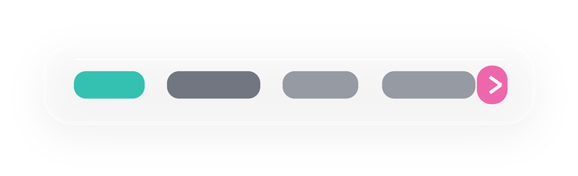
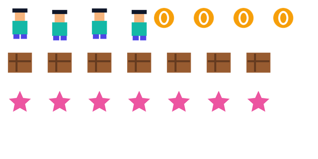

# Alphakit

Codex skill for generating, exporting, extracting, and verifying standard or transparent image assets.

Alphakit is built for practical asset work: Codex image generation, PNG/JPEG/WebP conversion, alpha-channel verification, black/white extraction, and background removal checks.

It supports:

- standard image generation/export to PNG, JPEG, or WebP
- Codex image generation as the source-image generator for prompt-to-image work
- verifying whether a PNG/WebP has a real alpha channel
- extracting alpha from aligned black-background and white-background image pairs
- approximate single-solid-background removal
- reproducible transparent example assets with prompts
- synthetic self-tests that compare method quality and reject misaligned pairs

## Install

Clone Alphakit directly into your Codex skills directory:

```bash
mkdir -p ~/.codex/skills
git clone git@github.com:vidhatanand/alphakit.git ~/.codex/skills/alphakit
```

Restart Codex after installing so the skill is discovered.

To update an existing Alphakit install:

```bash
cd ~/.codex/skills/alphakit
git pull
```

If you previously installed an older copy, install a fresh Alphakit checkout in `~/.codex/skills/alphakit` and remove the older folder only after the new skill is discovered.

Restart Codex after updating.

## Use

Invoke it by name:

```text
Use $alphakit to create a true transparent PNG from this image prompt.
```

For a standard image:

```text
Use $alphakit to generate this prompt as a JPEG.
```

For an existing image:

```text
Use $alphakit to remove the background from this image and verify the PNG has real transparency.
```

If you do not specify `PNG`, `JPEG`, or `WebP`, Alphakit instructs Codex to ask for the needed output format before generating or exporting.

For prompt-to-image requests, Alphakit uses Codex image generation first, then applies its own scripts for transparency extraction, export, and alpha verification. Generated source files and processed outputs should be kept separate so the workflow is auditable.

## Verified Demo Assets

The `examples/transparent/` folder contains verified transparent PNG assets and lossless WebP exports. Each example includes the source prompt in `examples/prompts.json`.

This folder intentionally avoids procedural fake-photoreal placeholders. Photorealistic humans, models, products, and catalog cutouts are covered as prompt recipes below so real image-generation output can be verified instead of represented by weak synthetic stand-ins.

| Asset | Type | Prompt |
| --- | --- | --- |
|  | Icon sprite sheet | `A compact transparent PNG sprite sheet with four polished app icons: sparkle, shield, lightning bolt, and cursor pointer, crisp vector-like edges, no background.` |
|  | Web page design element | `A transparent PNG website navigation component with frosted glass pill, subtle border, tab indicators, and no page background.` |
|  | Badge / sticker | `A transparent PNG launch badge for a modern AI tool, layered sticker shape, subtle shadow, clean edges, no background.` |
|  | Transparent illustration | `A stylized bird flying above a globe at 100 km altitude, clean editorial illustration, isolated subject, pure transparent background.` |
|  | Web page design element | `A transparent PNG hero-section swoosh divider with layered teal, coral, and ink ribbons, soft highlights, no background.` |
|  | Web animation sprite strip | `A transparent PNG sprite strip for a website CTA hover animation: eight frames of a frosted button glint, glow pulse, and clean alpha edges.` |
|  | Web animation sprite strip | `A transparent PNG sprite strip for a webpage success animation: eight frames of colorful particles expanding outward, clean alpha, no background.` |
|  | Game assets | `A transparent PNG game asset sprite sheet for a platformer: player idle frames, coins, crates, and collectible stars, crisp edges, no background.` |
|  | Game assets | `A transparent PNG game effects sprite sheet with eight explosion and magic-burst frames, smoke puffs, bright highlights, clean alpha, no background.` |

## Advanced Prompt Recipes, Not Demo Assets

Use these prompts with Alphakit when you want production-grade transparent assets. The assets above are deterministic demo files; the prompts below are written for real image generation workflows where Alphakit then verifies or extracts the final alpha.

### Photorealistic Product Cutout Set

```text
Use $alphakit to generate a transparent PNG and lossless WebP product cutout set: five premium skincare bottles arranged as separate isolated objects, photorealistic studio lighting, clear glass and brushed aluminum materials, visible liquid refraction, subtle contact shadows that remain part of the alpha subject, no floor, no backdrop, no checkerboard, no text, no watermark. Output at 2048x2048 with clean semi-transparent edge pixels suitable for ecommerce hover animations.
```

### Photorealistic Human Cutout Set

```text
Use $alphakit to generate a transparent PNG and lossless WebP human cutout set: six generic adult people, full-body, diverse outfits and poses, photorealistic studio lighting, realistic hair edges and fabric detail, each person isolated with clear spacing, no celebrities, no logos, no text, no floor, no backdrop, no checkerboard. Output at 3072x2048 with true alpha, preserve natural semi-transparent hair pixels, and verify transparency.
```

### Fashion Model Catalog Cutouts

```text
Use $alphakit to generate transparent PNG and lossless WebP fashion model cutouts: four generic adult models wearing unbranded streetwear, ecommerce catalog style, front three-quarter poses, realistic skin texture, fabric folds, shoes fully visible, soft contact shadows included only under each subject, no background, no studio wall, no text, no watermark. Export clean alpha for web product cards and verify PNG/WebP transparency.
```

### Photorealistic Hair Alpha Stress Test

```text
Use $alphakit to generate a transparent PNG portrait cutout of a generic adult model with detailed curly hair, photorealistic lighting, shoulders-up composition, clean alpha around individual hair strands, no background color, no halo, no checkerboard, no text. If native alpha fails, use an aligned black/white pair extraction and report edge quality before exporting WebP.
```

### Web Animation Sprite Strip

```text
Use $alphakit to generate a transparent PNG sprite strip for a website hero animation: 12 horizontal frames, each frame 256x256, a premium glassmorphism CTA badge assembling from soft particles into a sharp button, consistent center alignment, frame-to-frame motion continuity, transparent background, no page mockup, no text, no checkerboard. Also export a lossless WebP with alpha and verify transparency.
```

### Game Asset Pack

```text
Use $alphakit to generate a transparent PNG game asset sheet: 8x8 grid, 128px cells, top-down fantasy RPG items including potions, coins, keys, gems, crates, scrolls, hearts, and spell projectiles, consistent camera angle, readable silhouettes, no background, no shadows outside each cell, no text. Export PNG plus lossless WebP and verify alpha.
```

### Game Avatar Sprite Sheet

```text
Use $alphakit to generate a transparent PNG game avatar sprite sheet: one original non-celebrity character, 8 columns x 6 rows, 128px cells, idle, walk, run, jump, attack, and hurt animations, consistent proportions and outfit across all frames, pixel-perfect transparent background, no cell borders, no text, no shadows clipped at frame edges. Export PNG plus lossless WebP and verify every frame has alpha.
```

### Dialogue Avatar Portrait Pack

```text
Use $alphakit to generate a transparent PNG dialogue avatar pack: 12 original game character bust portraits, consistent art direction, varied expressions, clean silhouettes, readable at 256px, no copyrighted characters, no background, no text, no UI frame. Export as one sprite sheet plus individual transparent PNG crops, then verify alpha for every output.
```

### Game VFX Frames

```text
Use $alphakit to generate a transparent PNG VFX sprite sheet: 16 frames in a single row, a fire-to-magic impact burst expanding then fading, consistent origin point, no camera movement, bright core, smoke wisps with semi-transparent alpha, no black background, no checkerboard. Verify the PNG/WebP alpha and reject the result if any frame is opaque.
```

Regenerate the example set:

```bash
/Users/vid/.cache/codex-runtimes/codex-primary-runtime/dependencies/python/bin/python3 \
  scripts/build_examples.py
```

Verify every generated transparent PNG and WebP:

```bash
for image in examples/transparent/*.{png,webp}; do
  /Users/vid/.cache/codex-runtimes/codex-primary-runtime/dependencies/python/bin/python3 \
    scripts/verify_alpha.py "$image" >/dev/null
done
```

## Export Standard Images

```bash
python3 scripts/export_image.py \
  --input generated.png \
  --format jpeg \
  --out final.jpg \
  --background "#ffffff"
```

Use `--format webp --quality 90` for standard WebP output, or `--preserve-alpha --lossless` when WebP transparency is required.

## Verify Transparency

```bash
python3 scripts/verify_alpha.py output.png
```

If your system Python does not have Pillow installed, use the bundled Codex runtime:

```bash
/Users/vid/.cache/codex-runtimes/codex-primary-runtime/dependencies/python/bin/python3 \
  scripts/verify_alpha.py output.png
```

## Best Extraction Method

The most reliable extraction method is an aligned black/white pair:

```bash
python3 scripts/alpha_from_black_white.py \
  --black subject-on-black.png \
  --white subject-on-white.png \
  --out subject-transparent.png
```

This only works when both source images have identical subject placement and foreground pixels. Two independent AI generations usually do not align and should be treated as unsafe unless artifacts are acceptable.

## Test

```bash
/Users/vid/.cache/codex-runtimes/codex-primary-runtime/dependencies/python/bin/python3 \
  scripts/self_test.py
```

Expected result includes:

- aligned black/white alpha extraction with very low error
- single-background removal with higher error
- misaligned black/white pair rejected
- PNG and WebP alpha verification passing
- standard JPEG and WebP export passing
